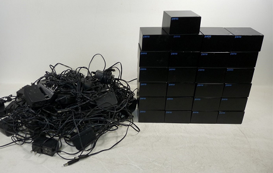

# Simple "Hello World" base project for Panologic G1
 

This project is intended to serve as a starting point for other projects 
targeting the first generation of the Panologic thin client.

This base includes the following features in HDL:

Features:
- picorv32 RISC-V core @ 100 Mhz
- 32MB 32 bit SDRAM with write back cache
- bit banged SPI flash interface
- 80 x 30 VGA character video
- 115200 output only debug UART
- USB controller register and memory access
- Bootloader in "ROM" which copies RISC-V code from SPI flash into SDRAM for execution
- Hello world example program

Not supported yet:
- Ethernet port
- Audio 

## What is a Panologic device and why do I care?

Panologic was a Bay Area startup that manufactured tiny thin clients that 
were connected to a central server.  The Pano devices have a Ethernet 
interface, a few USB ports, audio input and output ports, and one or two 
video ports.  

The first generation (G1) Pano was based on the largest Xilinx Spartan-3E 
family chip and supported a single VGA monitor.  

The second generation (G2) supported two DVI monitors.  Revision A and B 
of the G2 devices were based on the Spartan-6 LX150 which is the largest 
chip in the family.  The revision C G2 device is based on the smaller 
LX100 device which is still quite large by hobbist standards.  

Unfortunately for Panologic, but fortunate for FPGA hobbyists Panologic 
went out of business in 2012.  Shortly thereafter **TONS** of both new and 
used Panologic devices started showing up on ebay for very little money 
since they were pretty much useless without support.  Even today (Oct 
2019) both versions of the Panologic devices are still readily available 
on ebay for little. 

 

Tom Verbeure has spent a lot of time reverse engineering the Panologic 
devices and created an absolute mind blowing raytracing demo that runs on a 
G1 device.  It was the [Hackaday article](https://hackaday.com/2018/12/07/racing-the-beam-on-a-thin-client-in-fpgas/) article on his project that originally 
attracted my attention to the Pano hacking scene.  

Tom's article also got the attention of Wenting Zhang who added support 
for the G1's SDRAM and USB controller as well as making it possible to 
execute code on a soft processor directly from the SPI flash.  

This project was derived directly from an early commit from his [Verilog Boy](https://hackaday.io/project/57660-verilogboy-gameboy-on-fpga) project
before he moved to an execute in place (XIP) model.  

## HW Requirements

* A first generation Panologic thin client (G1, the one with a VGA port)
* A suitable 5 volt power supply
* A JTAG programmer to load the bitstream into flash

## Software Requirements

The free Webpack version of Xilinx [ISE 14.7](https://www.xilinx.com/support/download/index.html/content/xilinx/en/downloadNav/vivado-design-tools/archive-ise.html) is used for development.
Do **NOT** download the latest Windows 10 version as it does not support the 
Spartan 3E family of chips used in the first generation of the Pano device.

### Programming the Pano flash using xc3sprog

Install xc3sprog for your system.  If a binary install isn't available for your
system the original project can be found here: https://sourceforge.net/projects/xc3sprog/.
Sources can be checked out using subversion from https://svn.code.sf.net/p/xc3sprog/code/trunk.

As an alternate if you don't have subversion a fork of the original project
can be found here: https://github.com/Ole2mail/xc3sprog.git .

If your JTAG cable is not a Digilent JTAG-HS2 cable then you will need to edit 
the toplevel Makefile and change XC3SPROG_OPTS for your device.

Refer to the supported hardware [web page](http://xc3sprog.sourceforge.net/hardware.php) page or run  xc3sprog -c 
to find the correct cable option for your device.

Now that hard part is over, just run make to flash the new Xilinx bit stream 
and firmware image

### Programming the Pano flash using iMPACT

Use iMPACT to program .../xilinx/pano_z80.msc into flash.

1. Start iMPACT (Selecting Tools/iMPACT from ISE's menu is one way).
2. Double click "Boundary Scan" under iMPACT flows.
3. Right click in the Boundary Scan window and select Initialize chain.
4. Dismiss the Auto Assign dialog box by clicking No.
5. Click Ok on the Device Programming properties dialog.
6. Right click the "SPI/BPI ?" box shown above the Xilinx chip and select 
"Add SPI/BPI flash"
7. Navigate to .../xilinx/pano_hello_g1.mcs click Open.
8. Select "M25P80" from the drop down box on the dialog and click OK.
9. Right click the "Flash" box shown above the Xilinx chip and select 
"program".
10. Click OK on the Device Programming Properties dialog.
11. Cross fingers and hope that the program operation will be successful.

## Building Everything from Scratch

**NB:** While it may be possible to use Windows for development I haven't 
tried it and don't recommend it.

* Install the free Webpack version of Xilinx [ISE 14.7](https://www.xilinx.com/support/download/index.html/content/xilinx/en/downloadNav/design-tools/v2012_4---14_7.html)

* Follow the instruction in the [PicoRV32 repository](https://github.com/cliffordwolf/picorv32) to install the riscv32ic toolchain.

* Clone this github repository into `~/pano_hello_g1` and change into the root of the repository

* Build the bootrom
```
skip@dell-790:~/pano/working/pano_hello_g1$ (cd fw/bootloader/;make)
riscv32-unknown-elf-gcc -I../include -march=rv32i -O1 -ffreestanding -nostdlib  -Wl,-Bstatic,-T,sections_bl.lds,-Map=picorv_bl.map,--strip-debug -Wl,--no-relax -o picorv_bl.elf start_bl.s bootloader.c
size picorv_bl.elf
   text    data     bss     dec     hex filename
   3208       0      20    3228     c9c picorv_bl.elf
riscv32-unknown-elf-objcopy -O binary picorv_bl.elf picorv_bl.bin
../../tools/bin2mif/bin2mif picorv_bl.bin picorv_bl.mif 4096 32
../../tools/bin2mif/bin2mif picorv_bl.bin picorv_bl_0.mif 1024 8 0 3
../../tools/bin2mif/bin2mif picorv_bl.bin picorv_bl_1.mif 1024 8 1 3
../../tools/bin2mif/bin2mif picorv_bl.bin picorv_bl_2.mif 1024 8 2 3
../../tools/bin2mif/bin2mif picorv_bl.bin picorv_bl_3.mif 1024 8 3 3
cp *.mif ../../fpga
riscv32-unknown-elf-objdump -d picorv_bl.elf > picorv_bl.lst
skip@dell-790:~/pano/working/pano_hello_g1$
```

* Build the Hello world program

```
skip@dell-790:~/pano/working/pano_hello_g1$ (cd fw/hello_world/;make)
riscv32-unknown-elf-gcc -c -I../include -MD -O1 -march=rv32i -ffreestanding -nostdlib  start.s
riscv32-unknown-elf-gcc -c -I../include -MD -O1 -march=rv32i -ffreestanding -nostdlib  hello.c
riscv32-unknown-elf-gcc -I../include -MD -O1 -march=rv32i -ffreestanding -nostdlib  -Wl,-Bstatic,-T,sections.lds,-Map,hello.map,--strip-debug,--no-relax -o hello.elf start.o hello.o -lgcc
size hello.elf
   text    data     bss     dec     hex filename
    576       8       4     588     24c hello.elf
riscv32-unknown-elf-objdump -d hello.elf > hello.lst
riscv32-unknown-elf-objcopy -O binary hello.elf hello.bin
skip@dell-790:~/pano/working/pano_hello_g1$
```
This creates the file `~/pano_z80/fw/firmware/firmware.bin`

* Fire up Xilinx ISE

* Create the bitstream
    * File -> Open Project -> ~/pano_z80/xilinx/pano_hello_g1.xise
    * Double click on 'Generate Programming File'

### Useful Make targets for development

These targets assumed you have installed xc3sprog, if you haven't, well ...
then these won't be very useful after all.

Run "Make prog" from .../fw/hello_world to build and program JUST the RISC-V
image.  This provides a very fast build/debug/edit/build cycle by 
eliminating the need to touch ISE or iMPACT.  A typical build/flash takes
less than 10 seconds.  

Run "Make reload" to just reload the current .bit file into the Xilinx.  It
is NOT programmed into flash. This provides an easy way to reset the
FPGA and RISC-V processor.

Run "Make prog_fpga" to just flash the current .bit file into the SPI flash.

Run "Make prog_all" from the top level directory to flash the current .bit file
and RISC-V firmware.

Run "Make update_ram" from the .../fw/bootloader subdirectory to update the
boot rom image in the .bit file and reload the updated image.

## History

Last year Tom Verbeure's ray tracer [project](https://github.com/tomverbeure/rt) 
caught my eye and I bought a "few" PanoLogic devices and actually started to do
stuff with them.

The Pano devices have a huge potential as a hobbyist device but it's also a
steep hill to climb.  Luckily I didn't have to climb it alone or my Pano would
probably also be sitting around untouched.

I've created two prior projects using the Pano, a [pano_man](https://github.com/skiphansen/pano_man) and [pano_z80](https://github.com/skiphansen/pano_z80).
In each case I started by copying another finished Pano project and then 
immediately stripped out the stuff I didn't need.  The purpose of this project
is to eliminate the striping out step.

If you build/use/modify this project I'd enjoy hearing about it.  You can find 
my email address in the git log.  

## Acknowledgement and Thanks

Tom Verbeure's reverse engineering efforts and Panologic [bring up](https://github.com/tomverbeure/panologic) code made it possible
to get projects up and running rapidly without the reverse engineering drudgery.
Without Tom's work I would still be thinking of getting involved with FPGAs
"some day".

I started this project by cloning Wenting Zhang's [VerilogBoy](https://github.com/zephray/VerilogBoy)
project and then removing the Gameboy portions.

Wenting's contributions of bringing up the LPDDR Ram and USB subsystems on the 
first generation Panologic device has opened up a window of possibilities 
for Pano hacking immeasurably. Mr Zhang has my sincere thanks and admiration 
for his brilliant work.

## Pano Links

- [Original Hackaday](https://hackaday.com/2013/01/11/ask-hackaday-we-might-have-some-fpgas-to-hack/) article from 2013.  
- Hackady article on Tom's [Raytracker](https://hackaday.com/2018/12/07/racing-the-beam-on-a-thin-client-in-fpgas/).  
- Hackaday article on my [Pacman](https://hackaday.com/2019/01/11/pac-man-fever-comes-to-the-pano-logic-fpga/) project.  
- Hackaday article on Tom's [Joystick adapter](https://hackaday.com/2019/02/11/two-joysticks-talk-to-fpga-arcade-game-over-a-vga-cable/).  
- Wenting Zhang's [VerilogBoy](https://github.com/zephray/VerilogBoy) project.
- Hackaday article on My [pano_progfpga](https://hackaday.com/2019/04/19/pano-logic-fgpa-hacking-just-got-easier/) project
- My [prog_fpga](https://github.com/skiphansen/pano_progfpga) project.
- My [pacman](https://github.com/skiphansen/pano_man) project.
- My [Z80](https://github.com/skiphansen/pano_z80) project.
- https://github.com/tomverbeure/panologic
- G1 [Schematics!](https://github.com/twj42/PanoLogicG2_ReverseEngineering/blob/master/files/G1_Schematics.zip)
- https://github.com/tomverbeure/panologic-g2
- https://twj42.github.io/PanoLogicG2_ReverseEngineering/
- [Group](https://groups.io/g/panohackers/topics) for discussions about Panologic hacking 
- [Gitter](https://gitter.im/panologic/community) chat room for Panologic hackers.

## LEGAL 

This project was derived directly form Wenting Zhang's Verilog Boy project 
which was released under the GPL version 2. license.

Wenting further acknowledged the following:

>The PicoRV32 is free and open hardware licensed under the [ISC license](http://en.wikipedia.org/wiki/ISC_license)
(a license that is similar in terms to the MIT license or the 2-clause BSD license).

>Some firmware code of pano-g1 target are released to public domain.

>All other software codes are licensed under GNU GPL 2.0.

>All other HDL codes are licensed under OHDL 1.0.

>All other text documents are licensed under CC BY-SA 4.0


>If you use this material in any way a reference to the author (me :-) ) 
will be appreciated.

